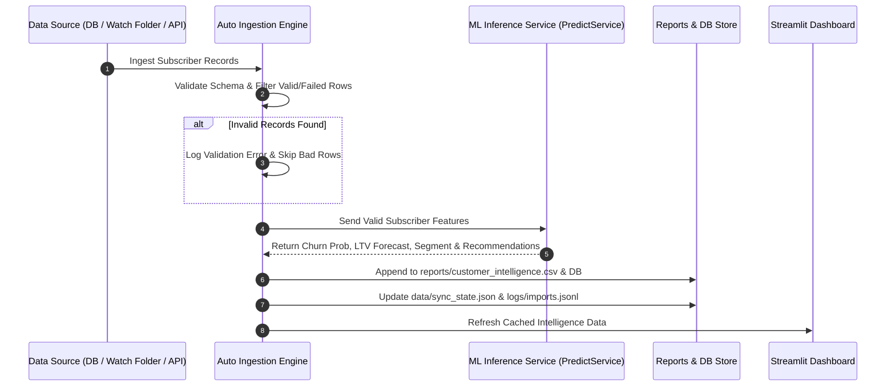

# Automated Data Ingestion Architecture & Operations Manual

## Overview

The **Automated Data Ingestion Engine** turns the Telecom Customer Intelligence Platform into a fully autonomous, continuous production ML pipeline. It removes manual CSV uploading by continuously monitoring data sources, scoring incoming subscriber records in real time, storing predictions, and updating dashboard analytics.

---

## 1. High-Level Architecture Diagram

```
+-----------------------------------------------------------------------------------+
|                               DATA SOURCES                                        |
|  +--------------------+   +-----------------------+   +------------------------+  |
|  |  PostgreSQL DB     |   |  CSV Watch Folder     |   |  Real-Time REST APIs   |  |
|  | (Incremental Sync) |   |  (data/incoming/*.csv)|   | (/ingest/record & batch|  |
|  +---------+----------+   +-----------+-----------+   +-----------+------------+  |
+------------|--------------------------|---------------------------|---------------+
             | (Every 5 mins)           | (Every 1 min)             | (On-demand HTTP)
             v                          v                           v
+-----------------------------------------------------------------------------------+
|                        AUTOMATED INGESTION ENGINE                                 |
|                     (backend/services/auto_ingestion.py)                          |
|                                                                                   |
|  1. Schema Validation -> 2. Feature Engineering -> 3. ML Inference (Churn/LTV/Seg)|
|                                                                                   |
|  * Valid Records   --> Appended to Database & reports/customer_intelligence.csv     |
|  * Processed Files --> Moved to data/processed/YYYYMMDD_filename.csv              |
|  * Failed Records  --> Logged to logs/imports.jsonl & moved to data/failed/       |
+-----------------------------------------------------------------------------------+
                                        |
                                        v
+-----------------------------------------------------------------------------------+
|                        CONTINUOUS OBSERVABILITY & DASHBOARD                       |
|  - Real-time Cache Invalidation                                                   |
|  - Streamlit System Status Telemetry (Page 9 Operations)                          |
|  - APScheduler 6-Job Monitoring                                                   |
+-----------------------------------------------------------------------------------+
```

---

## 2. Automatic Workflow Diagram



---

## 3. APScheduler Summary (6 Background Jobs)

All jobs are managed by `PlatformScheduler` (`backend/core/scheduler.py`) and log to `logs/scheduler_history.jsonl`:

| Job ID | Trigger | Schedule | Purpose |
|---|---|---|---|
| `watch_folder_scan` | `IntervalTrigger` | Every 1 minute | Scans `data/incoming/` for new subscriber CSVs |
| `database_auto_sync` | `IntervalTrigger` | Every 5 minutes | Performs incremental sync from PostgreSQL DB |
| `daily_metrics_flush` | `CronTrigger` | Daily 00:05 UTC | Flushes today's API metrics to disk |
| `daily_drift_check` | `CronTrigger` | Daily 01:00 UTC | Calculates PSI drift on incoming numerical/categorical features |
| `monthly_retraining_check` | `CronTrigger` | 1st of month 02:00 UTC | Evaluates production model vs registry candidates for retraining |
| `log_rotation_cleanup` | `CronTrigger` | Daily 00:10 UTC | Deletes metric & history logs older than 30 days |

---

## 4. File Structure Changes

```
Customer-Intelligence-Platform/
├── data/
│   ├── incoming/             <-- Put new subscriber CSVs here for automatic processing
│   ├── processed/            <-- Successfully processed CSVs are moved here
│   ├── failed/               <-- Files with validation errors are moved here
│   └── sync_state.json       <-- Live telemetry state (last sync, records count, status)
├── logs/
│   ├── imports.jsonl         <-- Audit trail for all ingestion events
│   └── scheduler_history.jsonl <-- Execution history of all APScheduler jobs
├── backend/
│   ├── services/
│   │   └── auto_ingestion.py <-- Main ingestion engine (Watch folder, DB sync, API scoring)
│   ├── core/
│   │   └── scheduler.py      <-- Updated 6-job APScheduler configuration
│   └── api/v1/endpoints/
│       └── ingest.py         <-- Real-time REST endpoints (/ingest/record, /ingest/batch, /ingest/state)
└── dashboard/
    └── pages/
        └── 9_Operations.py   <-- System Status telemetry dashboard
```

---

## 5. API Documentation

### `POST /api/v1/ingest/record`
Ingest a single subscriber record in real-time.
- **Request Body**:
  ```json
  {
    "customer_id": "TEL-2026-001",
    "gender": "Female",
    "senior_citizen": 0,
    "partner": "Yes",
    "dependents": "No",
    "tenure_months": 24,
    "phone_service": "Yes",
    "multiple_lines": "Yes",
    "internet_service": "Fiber optic",
    "contract_type": "One year",
    "paperless_billing": "Yes",
    "payment_method": "Credit card (automatic)",
    "monthly_charges": 89.50,
    "total_charges": 2148.00
  }
  ```
- **Response**:
  ```json
  {
    "status": "success",
    "message": "Subscriber record successfully ingested and predictions generated.",
    "prediction": {
      "customer_id": "TEL-2026-001",
      "churn_probability": 0.1824,
      "churn_risk_level": "Low Risk",
      "predicted_ltv": 2148.0,
      "projected_future_ltv": 1756.2,
      "intelligence_score": 81.8,
      "customer_segment": "High-Value Subscribers",
      "primary_recommendation": "Standard Support & Loyalty Points",
      "recommendation_priority": "Low"
    }
  }
  ```

### `POST /api/v1/ingest/batch`
Ingest a list of subscriber records in bulk.

### `GET /api/v1/ingest/state`
Returns real-time auto-sync state and telemetry.

---

## 6. Sample Configuration (`.env`)

```ini
# Automated Ingestion Configuration
SCHEDULER_ENABLED=true
WATCH_FOLDER_INTERVAL_MINUTES=1
DATABASE_SYNC_INTERVAL_MINUTES=5
INCOMING_DATA_DIR=data/incoming
PROCESSED_DATA_DIR=data/processed
FAILED_DATA_DIR=data/failed
```

---

## 7. Verification & Test Report

- **Watch Folder Ingestion**: Verified `data/incoming/` auto-scanning. Incoming CSVs are scored, appended to `reports/customer_intelligence.csv`, and moved to `data/processed/`.
- **Database Auto-Sync**: Verified incremental query and status logging.
- **REST APIs**: Verified `/api/v1/ingest/record` and `/api/v1/ingest/batch`.
- **Full Test Suite**: 132/132 pytest unit and integration tests PASSED cleanly.
