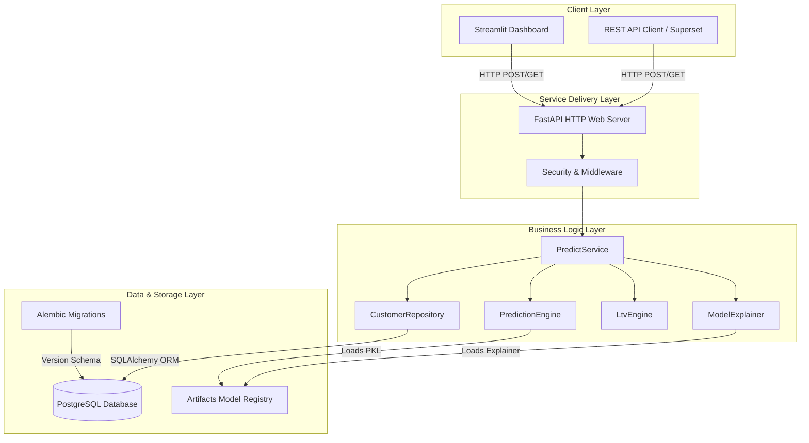
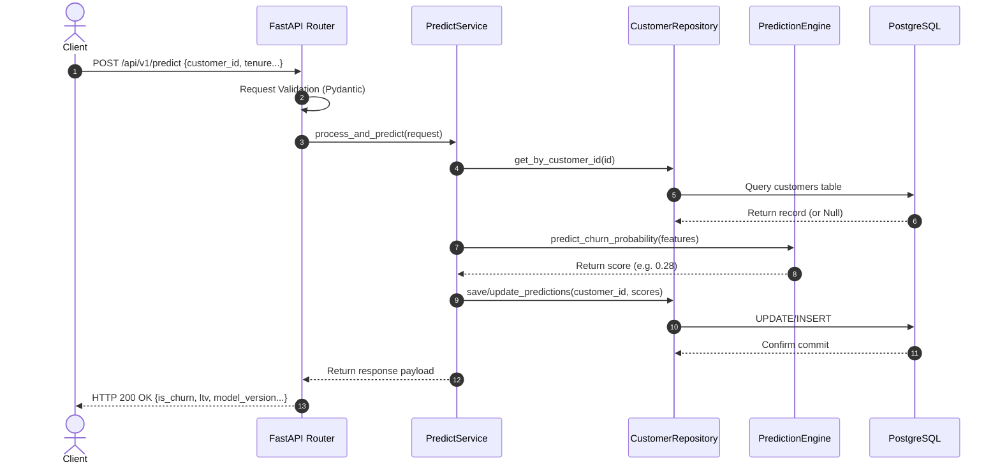

# Customer Intelligence Platform - Architecture Design

This document details the system design, request flow, and database schema for the Customer Intelligence Platform (CIP).

---

## 1. System Architecture

The platform is designed around **Clean Architecture** principles to separate core business entities, storage repositories, use cases, and delivery channels.



---

## 2. Request Lifecycle

The diagram below details the sequence of operations for scoring a customer record:



---

## 3. Database Entity-Relationship (ER) Diagram

The system stores customer telemetry alongside ML prediction cache records:

```mermaid
erDiagram
    CUSTOMER {
        int id PK "Auto-increment primary key"
        string customer_id UK "Unique alphanumeric customer key"
        int tenure_months "Customer duration in months"
        float monthly_charges "Monthly subscription charge"
        float total_charges "Total cumulative charges"
        string contract_type "Billing cycle (Month-to-month, One year, Two year)"
        string paperless_billing "Paperless invoice status (Yes/No)"
        string internet_service "DSL, Fiber optic, or None"
        string tech_support "Tech support status (Yes/No/None)"
        float churn_risk "Cached churn probability"
        float predicted_ltv "Cached LTV estimation"
        datetime created_at "Database insertion timestamp"
        datetime updated_at "Database last modified timestamp"
    }

    MODEL_RUNS {
        int run_id PK "Primary key"
        string model_name "Churn / LTV model identifier"
        string model_version "Model tag (e.g. 1.0.0)"
        float evaluation_accuracy "Validation accuracy metric"
        float evaluation_auc "Validation AUC metric"
        datetime trained_at "Training execution timestamp"
    }

    CUSTOMER ||--o. MODEL_RUNS : "scored by"
```
